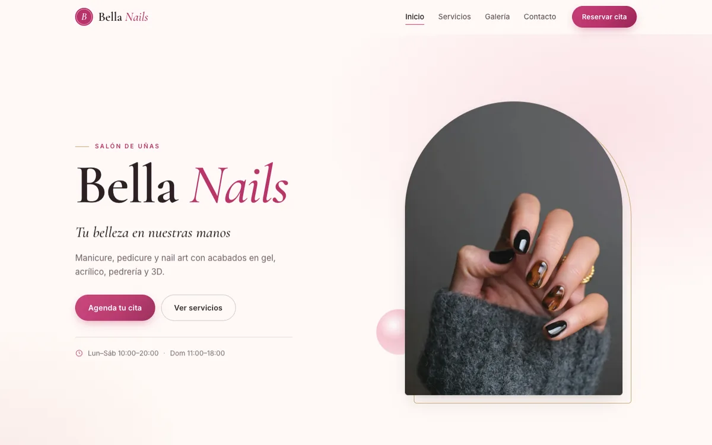
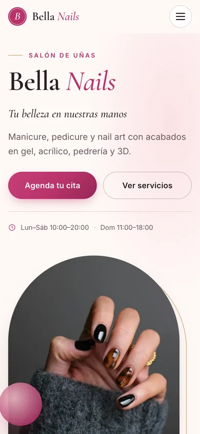

# Bella Nails — sitio web del salón de uñas

Sitio de una sola página para **Bella Nails**, un salón de uñas: servicios con precios, galería de trabajos con visor ampliado y formulario para solicitar cita.

**Ver en vivo:** https://gustavolarcodev.github.io/bella-nails-salon/

<p>
  
  
</p>

## Funcionalidades

- **Diseño responsive** probado en 1440 px, 390 px y 360 px de ancho, sin scroll horizontal; menú compacto con botón hamburguesa en móvil.
- **Servicios** con precios y botón “Reservar” que preselecciona el servicio en el formulario.
- **Galería** en cuadrícula editorial con visor (`<dialog>`) accesible: teclado (Esc, flechas), gesto de deslizar en móvil y foco gestionado.
- **Formulario de reserva** con etiquetas visibles, validación en el navegador, fecha mínima = hoy y envío mediante un correo prellenado (`mailto:`); no necesita backend.
- **Imágenes optimizadas**: WebP con respaldo JPG, `srcset`/`sizes`, dimensiones explícitas y carga diferida. La primera carga pesa unos 0,3 MB.
- **Accesibilidad**: enlace “Saltar al contenido”, landmarks semánticos, estados de foco visibles, textos alternativos descriptivos, contraste AA y respeto a `prefers-reduced-motion`.
- **SEO**: meta descripción, Open Graph / Twitter Card, URL canónica, favicon SVG + PNG y datos estructurados `NailSalon` (JSON-LD).

## Tecnología

HTML5, CSS3 (custom properties, Grid, `clamp()`), JavaScript vanilla. Sin frameworks ni paso de build. Tipografías: Cormorant Garamond e Inter (Google Fonts).

```
index.html      estructura y contenido
styles.css      estilos
script.js       menú, galería, animaciones y formulario
images/         imágenes optimizadas (WebP/JPG) e imagen para redes (og.jpg)
docs/           capturas para este README
```

## Ejecutar en local

```bash
python3 -m http.server 8000
# abrir http://localhost:8000
```

## Despliegue

Publicado con GitHub Pages desde la raíz de la rama principal. Todas las rutas son relativas, así que funciona bajo `/bella-nails-salon/` sin configuración extra (incluye `.nojekyll`).
